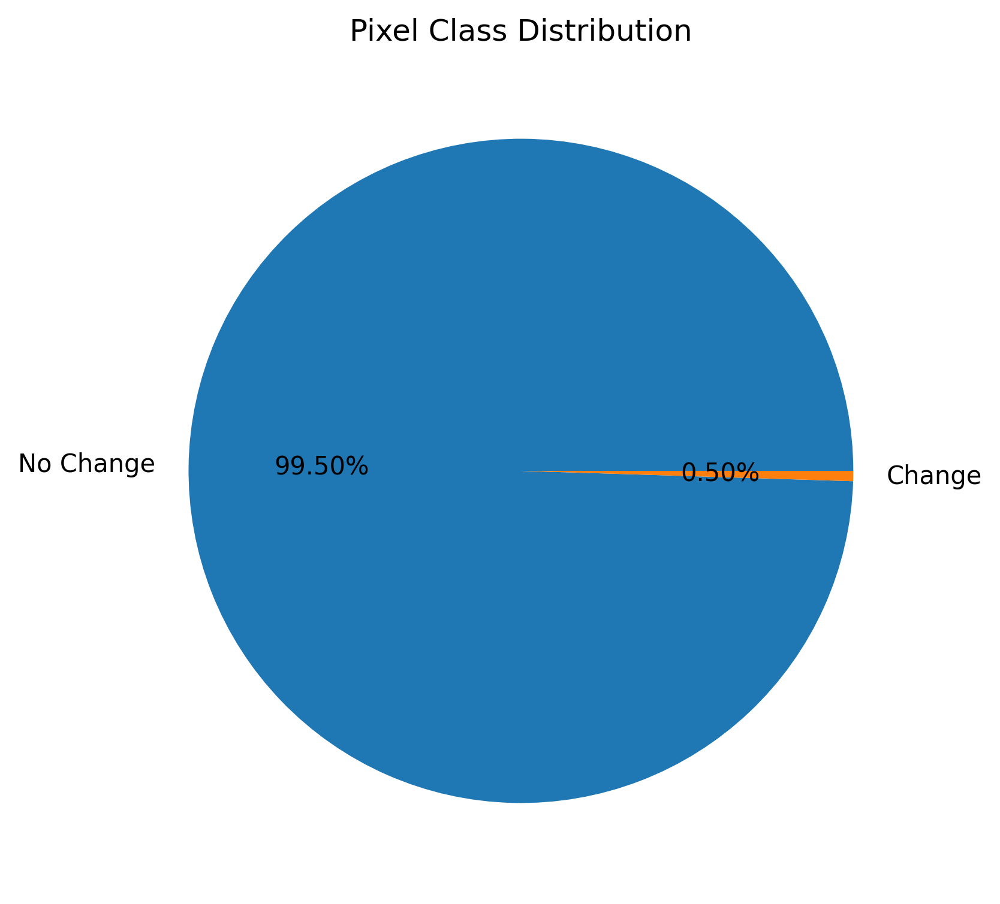
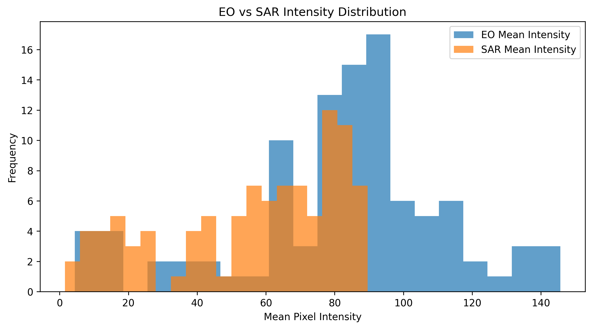
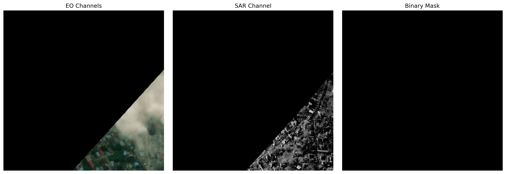
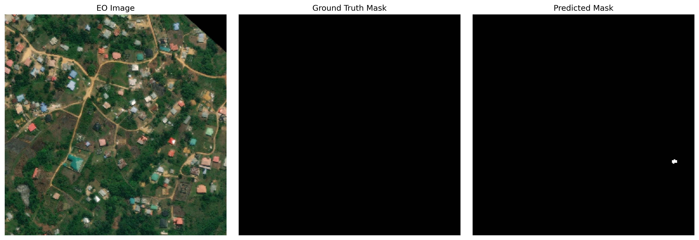
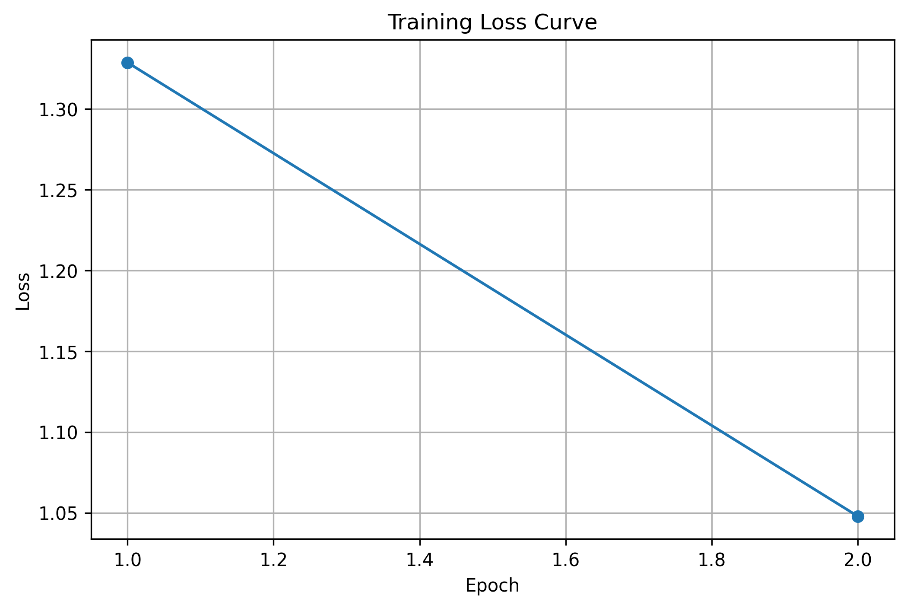
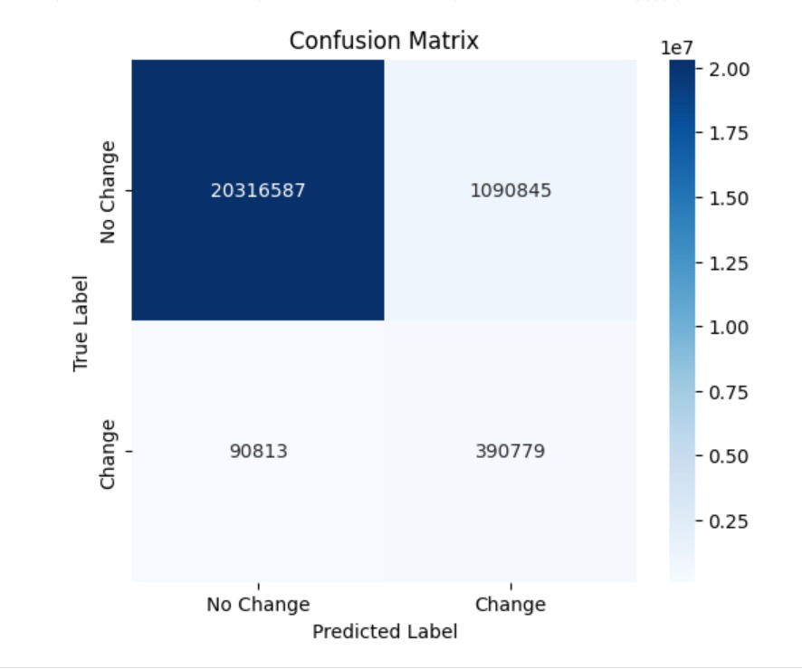

# EO-SAR Multimodal Change Detection

## Project Title & Description

This project presents a deep learning based multimodal semantic segmentation framework for disaster-related change detection using Optical Earth Observation (EO) imagery and Synthetic Aperture Radar (SAR) imagery.

The proposed system performs binary semantic segmentation to identify regions of change between pre-event EO images and post-event SAR images. The framework combines EO and SAR modalities into a unified 4-channel representation and uses a U-Net architecture with a ResNet34 encoder backbone for segmentation.

The project was implemented using PyTorch and segmentation_models_pytorch and evaluated using IoU, Precision, Recall, and F1-score metrics.

---

# Requirements

## Python Version

```bash
Python 3.12
```

## Dependencies

Install all dependencies using:

```bash
pip install -r requirements.txt
```

## requirements.txt

```txt
torch
torchvision
numpy
opencv-python
matplotlib
albumentations
segmentation-models-pytorch
scikit-learn
tqdm
seaborn
PyYAML
jupyter
```

---

# Environment Setup

## Clone Repository

```bash
git clone <https://github.com/shr1ti/galaxeye-change-detection.git>

cd galaxeye-change-detection
```

---

## Create Virtual Environment

### Windows

```bash
python -m venv venv

venv\Scripts\activate
```

### Linux / Mac

```bash
python3 -m venv venv

source venv/bin/activate
```

---

## Install Dependencies

```bash
pip install -r requirements.txt
```

---

# Dataset Structure

Place the dataset inside the `data/` directory using the following structure:

```text
data/
├── train/
│   ├── pre-event/
│   ├── post-event/
│   └── target/
│
├── val/
│   ├── pre-event/
│   ├── post-event/
│   └── target/
│
├── test/
│   ├── pre-event/
│   ├── post-event/
│   └── target/
```

---

# Model Architecture

- Architecture: U-Net
- Encoder: ResNet34
- Encoder Weights: ImageNet
- Input Channels: 4
- Output Classes: 1
- Loss Function: Hybrid BCE + Dice Loss

---

# Training

Run training using:

```bash
python train.py --config configs/config.yaml
```

Training configuration is stored in:

```text
configs/config.yaml
```

---

# Evaluation

Run evaluation using:

```bash
python eval.py
```

The evaluation pipeline computes:

- Precision
- Recall
- F1-score
- IoU score

on validation and test datasets.

---

# Model Weights

Download trained model weights here:

https://drive.google.com/file/d/1CZWvWJ5f4DegFWlFh-8FdSbT3h9Lni8j/view?usp=sharing


```


# Results

## Validation Results

| Metric | Score |
|---|---|
| Precision | 0.2638 |
| Recall | 0.8114 |
| F1-Score | 0.3981 |
| IoU | 0.2485 |

---

## Test Results

| Metric | Score |
|---|---|
| Precision | 0.0578 |
| Recall | 0.1768 |
| F1-Score | 0.0871 |
| IoU | 0.0455 |

---

# Observations

- The model achieved strong recall on validation data, indicating effective detection of change regions.
- Lower precision and IoU scores indicate the presence of false positives and limited generalization on unseen test data.
- Severe class imbalance, sparse foreground masks, SAR noise, and multimodal domain differences significantly affected performance.

---

# Outputs

The repository includes:

- Training loss curves
- Confusion matrix
- Prediction visualizations
- Validation and test evaluation metrics
- Qualitative segmentation analysis

---

# Output Figures

## Class Distribution



---

## EO-SAR Distribution



---

## Dataset Pipeline Validation



---

## Prediction Visualization



---

## Training Loss Curve



---

## Confusion Matrix



---

# Future Work

Potential future improvements include:

- Transformer-based segmentation architectures
- Attention-enhanced multimodal fusion
- Higher resolution training
- Longer training schedules
- Advanced SAR despeckling techniques
- Class-balanced loss functions
- Temporal feature modeling

---

# Citation / References

The following papers, datasets, and codebases were consulted during development:

1. X. Liu, L. Ding, Y. Li, C. Dai, Z. Zhang, M. Li, Z. Yang, Y. Sun, Y. Sun, and H. Wang,  
   **“STSF-Net: Spatial-Temporal Semantic Fusion Network for Multimodal Change Detection Between Optical and SAR Images.”**  
   Available: https://doi.org/10.48550/arXiv.2604.05527

2. R. M. Anwer, F. S. Khan, J. van de Weijer, M. Molinier, and J. Laaksonen,  
   **“Binary Patterns Encoded Convolutional Neural Networks for Texture Recognition and Remote Sensing Scene Classification.”**  
   *ISPRS Journal of Photogrammetry and Remote Sensing*, vol. 138, pp. 74–85, Apr. 2018.  
   Available: https://doi.org/10.48550/arXiv.1706.01171

3. IEEE GRSS Data Fusion Contest 2026,  
   **“Commercial SAR Systems and Real-World Remote Sensing Challenges.”**  
   IEEE Geoscience and Remote Sensing Society, 2026.  
   Available: https://www.grss-ieee.org/community/technical-committees/2026-data-fusion-contest/

4. M. V. Perera, N. G. Nair, W. G. C. Bandara, and V. M. Patel,  
   **“SAR Despeckling Using a Denoising Diffusion Probabilistic Model.”**  
   *IEEE Geoscience and Remote Sensing Letters*, vol. 20, pp. 1–5, 2023.  
   Available: https://doi.org/10.1109/LGRS.2023.3270799

5. B. Zou, J. Qin, and L. Zhang,  
   **“Vehicle Detection Based on Semantic-Context Enhancement for High-Resolution SAR Images in Complex Background.”**  
   *IEEE Geoscience and Remote Sensing Letters*, vol. 19, pp. 1–5, 2022.  
   Available: https://ieeexplore.ieee.org/document/9666902/

6. X. Bai, X. Pu, and F. Xu,  
   **“Conditional Diffusion for SAR to Optical Image Translation.”**  
   *IEEE Geoscience and Remote Sensing Letters*, vol. 21, pp. 1–5, 2024.

7. segmentation_models_pytorch Documentation  
   Available: https://github.com/qubvel-org/segmentation_models.pytorch

8. PyTorch Documentation  
   Available: https://pytorch.org/docs/stable/index.html

9. Albumentations Documentation  
   Available: https://albumentations.ai/docs/

---

# Author

Shriti Sharma
